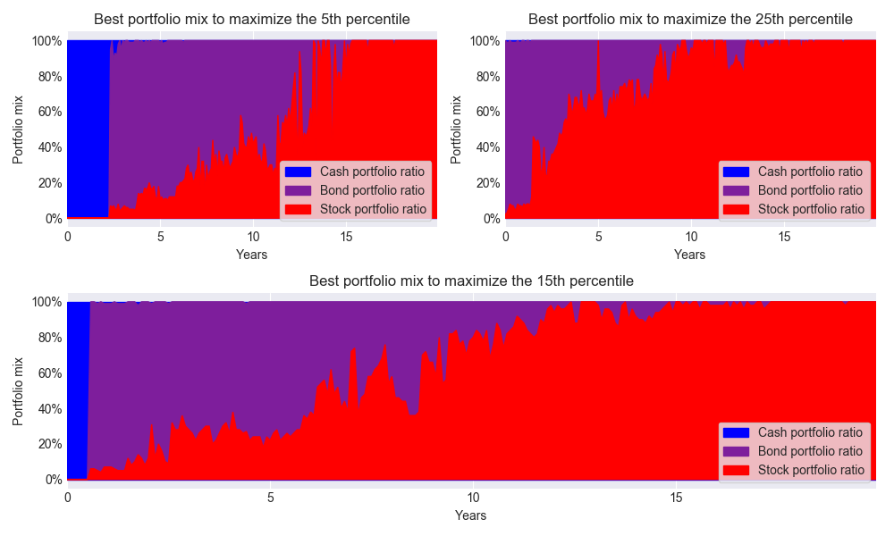

# dead_broke

Various scripts based on python and matplotlib for simulating and visualizing various types of data relevant to personal finance. 

Examples of the output: 

A DAB (Death and Bankruptcy) graph.

How the tax code favors or penalizes married couples relative to two single people with equivalent incomes. 

Whether bonds, stocks, or cash are likely to provide the best overall returns in different historical time periods.

What portfolio mix of bonds, stocks, or cash provide the best return in different percentiles.

# running

* install humor sans font (on debian/ubuntu `sudo apt install fonts-humor-sans`)
* `pip3 install matplotlib`
* `cd stocks_vs_bonds_vs_cash`
* `python3 projections_threeway.py`

